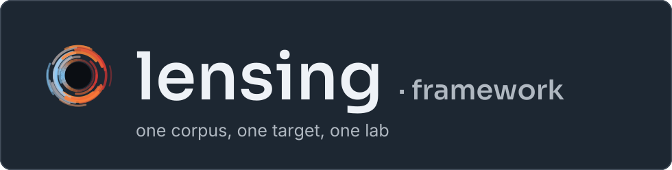
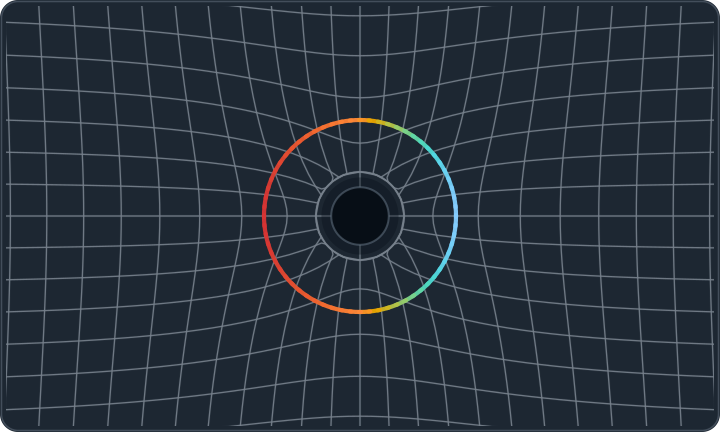

<p align="center"></p>

<p align="center">
<b>A prediction lab you operate by talking to it.</b><br>
Point lensing at a corpus of embedded documents, say what you want to predict,
and you get the whole loop — datasets, a model registry, batched training runs,
a leaderboard, a promoted model you can ship, and a written experimental record.<br>
<b>Your coding agent is the interface.</b>
</p>

<p align="center">
<a href="#what-a-session-looks-like">a session</a> ·
<a href="#your-coding-agent-is-the-interface">the interface</a> ·
<a href="#the-loop-and-the-record">the loop</a> ·
<a href="#start-a-project">start a project</a> ·
<a href="#run-it">run it</a> ·
<a href="#whats-inside">what's inside</a> ·
<a href="docs/REFERENCE.md">reference</a>
</p>

## What a session looks like

<p align="center"></p>

No wizard, no glue scripts. You say what you want in a sentence; a skill turns
it into the right API calls, checks the things that are easy to get wrong, and
answers in the vocabulary of *your* domain — your entity noun, your target,
your units.

Four things happened up there that are worth naming, because they are the
opinions lensing actually holds:

- **It preflighted before it built.** Quality rules are evaluated against the
  corpus and reported — counts and sample rows — *before* anything is written,
  so you tune the filters knowing what they drop.
- **It designed a scan, then executed it.** The design (axes, batching,
  decision rule) is a document you approve; execution is a separate agent that
  refuses ambiguous designs rather than guessing.
- **It reported in target space.** The pipeline transforms the target
  (`log1p` by default); every metric and prediction that reaches you is
  inverted back. A leaderboard in log space is a bug, not a convention.
- **It wrote the campaign down.** A run that produced no report is a run that
  did not happen. The report and the reconciled `PROJECT-FACTS.md` are the
  deliverable, and they are the first thing the *next* design reads.

## Your coding agent is the interface

<p align="center"></p>

The process knowledge lives once, in `agents-src/`. `zig build render-agents`
substitutes your `domain.toml` into it and writes the same instructions into
every harness layout:

| harness | reads |
|---|---|
| **Claude Code** | `.claude/skills/` + `.claude/agents/` (+ `CLAUDE.md`) |
| **Gemini CLI** | `.gemini/skills/` |
| **Codex**, and anything else on the `AGENTS.md` convention | `.agents/skills/` |

Same instructions, same API, same instance — drive it from whichever agent you
already live in, or from several against one server.

### The skills

| skill | what you say it for |
|---|---|
| `/bootstrap` | point a fresh instance at your corpus and interview you into a `domain.toml` |
| `/dataset-design` | preflight quality filters, analyze the feature spectrum, build, inspect, rename datasets |
| `/model-definitions` | define / clone / tag / launch named hyperparameter presets; run a scan and write it up |
| `/report-curator` | fold campaign reports into one living LaTeX report and rebuild the PDF |
| `/model-export` | export a promoted model as a portable ONNX bundle that runs outside lensing |
| `/showcase` | publish a promoted model as a standalone Cloudflare-Worker demo site |
| `/information-capture` | compare what competing MLPs actually encode, via per-layer sparse autoencoders |
| `/upstream-sync` | pull newer framework code into your instance without clobbering your work |
| `/upstream-contribute` | generalize a fix you made and file it back to the mother repo as a PR |

Behind them sit the agents that do the long work: **experiment-designer**
(mines the record, proposes the next most informative scan — design only),
**experiment-runner** (executes an approved design end to end and writes the
report), **dataset-architect**, **best-model-selector**, **report-curator**,
**showcase-builder**, **information-capture-analyst** and the two
upstream agents.

### Two other doors into the same server

The agent layer is a *convenience over an API*, not a wrapper you are stuck in.
Everything it does, you can do:

- **The Control Room** — the Vite + React UI at `http://localhost:8080`: run
  forms generated from each predictor's schema, live loss traces, drill-down
  into per-row predictions, dataset and model pages. See [DESIGN.md](DESIGN.md).
- **The HTTP API** — [`docs/openapi.yaml`](docs/openapi.yaml), served by the
  running instance at `/api/openapi.yaml` with Swagger UI at `/docs`. `curl`
  works fine.

## The loop and the record

<p align="center"></p>

A dataset is a plain directory of little-endian binaries plus a
`manifest.json` — readable from any language with `numpy.fromfile` or a
`Float32Array`. A run is a subprocess that speaks JSON-lines on stdout. A
model is a directory holding everything inference needs, frozen at promotion
so it survives restarts and deletions. A campaign is a report in
`experiments/` plus a reconciled row in `PROJECT-FACTS.md`.

That last one is enforced, not merely encouraged. `tools/lensing_guard.py`
is the single source of truth for three invariants, and the hooks in
`.claude/settings.json` act on its verdict:

1. **An instance owns its folder.** It must be a complete copy produced by
   `zig build package`, unpacked somewhere of its own — never the framework
   checkout, never a partial tree. `.lensing-upstream.json` proves it.
2. **Bootstrap always finishes.** While an instance is unbootstrapped,
   `/bootstrap` is the only work permitted; the session may not end until the
   invariants pass or you record a decision to stop.
3. **Explorations go through the agents.** Launching runs and building
   datasets needs a run ticket, so an experiment can't start outside the
   designer → runner path that writes the report. One-off runs you explicitly
   ask for are the documented exception.

Run `zig build bootstrap-check` to see the verdict at any time.

## Start a project

<p align="center"></p>

That picture is the whole idea, and the name. A regular lattice — a generic
framework — bends around the mass at its center the way spacetime bends around
a galaxy. Nothing about lensing is about any one domain; it takes the shape of
whichever data you put at the middle of it.

So a project is not a config file inside a shared repo. **A project is its own
full copy of the framework**, in its own folder, with its own corpus, server,
models and experimental record:

```sh
zig build package                       # -> dist/lensing.tar.gz
tar xzf dist/lensing.tar.gz -C ~/projects
mv ~/projects/lensing ~/projects/used-car-prices
cd ~/projects/used-car-prices           # then, in your agent: /bootstrap
```

Bootstrapping *this* checkout is refused on purpose — the framework repo
carries a `.lensing-mother` marker and no provenance manifest.

`/bootstrap` interviews you into `domain.toml` — the single source of domain
truth — and everything else follows from it: dataset levers, metric columns,
UI copy, the agents' vocabulary, even the brand mark. A complete worked
example, the framework's original problem exercising every lever, ships at
[`crates/lensing-core/src/example-domain.toml`](crates/lensing-core/src/example-domain.toml).
Not sure you have a corpus yet? `crates/lensing-intake` builds one from a
database, a flat file or an HTTP API, embedding as it goes.

The full day-1 checklist is **[BOOTSTRAP.md](BOOTSTRAP.md)**.

## Run it

With Zig installed, `build.zig` is the project runner across all four
toolchains (cargo, npm, python, julia):

```sh
zig build serve            # build backend + UI, start Postgres, serve on :8080
```

Without Zig, by hand:

```sh
cargo build --release                            # pipeline, server, Rust predictors
cd ui && npm install && npm run build && cd ..
cargo run --release -p lensing-server             # http://localhost:8080
```

Containerized: `cp docker/.env.example .env && zig build docker-up` runs the
whole instance in Docker — one image, three roles (hub / worker / inference)
that also split across machines. See **[docs/DEPLOY.md](docs/DEPLOY.md)**.

One-time setup for the optional toolchains: `zig build py-setup` creates
`predictors/.venv` from `predictors/requirements.txt` (CPU PyTorch wheels;
`baseline-median` stays on system `python3`), and `zig build julia-setup`
instantiates the Flux.jl predictors.

### The runner

Each tool keeps its own incremental cache, so steps are cheap to re-run.
`zig build -l` prints the full list.

| step | what it does |
|------|--------------|
| `zig build` | default: `backend` + `ui` |
| `zig build backend` | `cargo build --release --workspace` (`registry.toml` points at `target/release/`) |
| `zig build ui` | `npm install` + `npm run build` → `ui/dist` (what lensing-server serves) |
| `zig build serve` | build everything, start the database, run `lensing-server` (Ctrl-C to stop) |
| `zig build dev` | Vite dev server with hot reload; needs a running server for `/api` |
| `zig build worker` | training worker: claims queued runs from the hub |
| `zig build infer` | predict-only inference node on :8090 |
| `zig build db-up` / `db-down` | start / stop the Postgres metadata database (the volume survives) |
| `zig build migrate-data` | backfill file-based state into Postgres, print a consistency report |
| `zig build dataset` | build a dataset artifact from Qdrant with default flags |
| `zig build render-agents` | re-render `.claude/` `.gemini/` `.agents/` from `agents-src/` + `domain.toml` |
| `zig build test` / `lint` / `py-check` | Rust tests · UI `tsc -b` + eslint · Python predictor syntax |
| `zig build check` | everything CI runs: the three above + agent-template drift |
| `zig build bootstrap-check` | the instantiation invariants (own folder, complete copy, bootstrap finished) |
| `zig build package` | package the framework as a template under `dist/` |
| `zig build py-setup` / `julia-setup` | one-time Python venv · Julia package instantiation |
| `zig build deploy-env` | seed `.env` deploy identity/ports from `domain.toml` `[deploy]` |
| `zig build docker-build` / `docker-up` | build the images · run a containerized instance (`-Ddocker-profile=hub\|worker\|infer`) |

Options apply to `serve` and `dataset`:

```sh
zig build serve -Dport=9000 -Dqdrant-url=http://qdrant:6333 -Dcollection=my-corpus
```

For non-default dataset flags (PCA dims, quality filters, …) call
`target/release/lensing-pipeline build --help` directly.

## What's inside

A Rust core, a plugin protocol thin enough that a predictor can be a 40-line
Python script, and a React frontend.

```
crates/lensing-core/         shared types + artifact I/O
crates/lensing-pipeline/     Qdrant fetch → features → PCA → dataset artifact
crates/lensing-intake/       raw source (DB / file / HTTP) → embeddings → Postgres + Qdrant
crates/lensing-db/           Postgres metadata store + migrations
crates/lensing-server/       axum API, run orchestration, static UI
crates/lensing-onnx/         dependency-free ONNX writer used by the Rust predictors
crates/lensing-sae/          sparse autoencoders behind /api/interp
crates/predictor-*/          Rust predictors (burn MLP, burn 1-D CNN, blend)
predictors/                  Python + Julia predictors (see below)
ui/                          Vite + React frontend — "The Control Room"
clients/js/                  @lensing/inference: run an ONNX export outside lensing
clients/showcase/            generated standalone demo apps (the /showcase skill)
data/                        gitignored: datasets/, runs/, models/
```

**Predictors are just executables.** Anything registered in `registry.toml`
that implements `train` (and optionally `predict` and `export`) is a first-
class citizen; its hyperparameter schema drives the run form in the UI
automatically. Fifteen ship registered, deliberately spread across languages
and families to prove the contract is not Rust-shaped:

| family | |
|---|---|
| neural | `burn-mlp` (Rust/burn), `flux-mlp` (Julia/Flux), `burn-cnn`, `torch-cnn` (PyTorch), `flux-cnn` — the three 1-D CNNs mirror each other |
| trees | `xgboost`, `lightgbm`, `random-forest` |
| kernel & linear | `ridge`, `kernel-ridge`, `svm`, `svm-moe` (GMM + SVR), `svm-quantile-moe` |
| meta | `blend` (ensembles promoted models), `baseline-median` (the floor — one stdlib-Python script, no dependencies) |

Writing your own is one page of contract: [docs/REFERENCE.md](docs/REFERENCE.md).

**Framework upgrades run both ways.** Instances track provenance in
`.lensing-upstream.json`. `/upstream-sync` pulls newer framework code *into*
an instance without touching instance-owned files; `/upstream-contribute`
finds framework files your instance improved, generalizes them (domain
literals de-instantiated back into render placeholders so other instances can
adopt them) and files a PR against the mother repo. Both are gated — nothing
applies or pushes without your explicit approval.

## Documentation

| | |
|---|---|
| [BOOTSTRAP.md](BOOTSTRAP.md) | the day-1 checklist for a new project |
| [docs/REFERENCE.md](docs/REFERENCE.md) | dataset artifact format, predictor contract, `registry.toml`, `models.toml`, HTTP API |
| [docs/DEPLOY.md](docs/DEPLOY.md) | Docker, and splitting hub / workers / inference across machines |
| [DESIGN.md](DESIGN.md) | the Control Room design system |
| [docs/openapi.yaml](docs/openapi.yaml) | machine-readable API — served at `/docs` by a running instance |
| [`crates/lensing-core/src/example-domain.toml`](crates/lensing-core/src/example-domain.toml) | a fully worked `domain.toml` |
| [branding/README.md](branding/README.md) | how the mark, the banner and the figures above are generated |

## License

Copyright (C) 2026 Eduardo Gonik

This program is free software: you can redistribute it and/or modify it
under the terms of the GNU Affero General Public License as published by
the Free Software Foundation, either version 3 of the License, or (at
your option) any later version.

This program is distributed in the hope that it will be useful, but
WITHOUT ANY WARRANTY; without even the implied warranty of
MERCHANTABILITY or FITNESS FOR A PARTICULAR PURPOSE. See the GNU Affero
General Public License for more details.

You should have received a copy of the GNU Affero General Public License
along with this program (see [LICENSE](LICENSE)). If not, see
<https://www.gnu.org/licenses/>.
